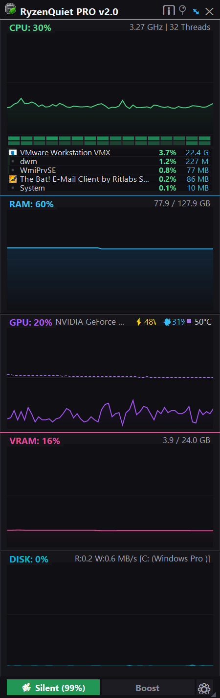
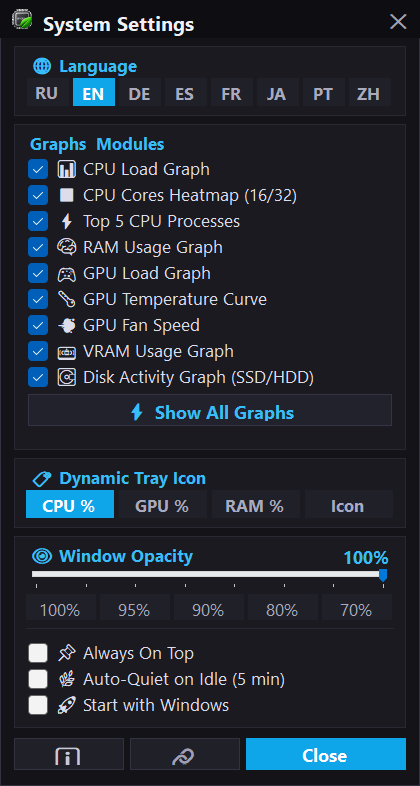

<div align="center">

# ⚡ RyzenQuiet PRO (v2.0)
**Sleek, lightweight hardware HUD & power-plan optimizer for Windows with AMD Ryzen CPB toggle and real-time GPU power telemetry.**

[-blue.svg)](#)
[](https://dotnet.microsoft.com/)
[](LICENSE)
[](https://github.com/SaidAuita/RyzenQuietPro/releases)
[](#)

<br/>


&nbsp;&nbsp;


<br/>

[**Download Standalone (~70 MB)**](https://ph-cu-s.com/tools/ryzenquietpro) &bull; [**Download Lite (~1.2 MB)**](https://ph-cu-s.com/tools/ryzenquietpro) &bull; [**Official Website**](https://ph-cu-s.com/tools/ryzenquietpro)

<br/>

*[English](#english) &bull; [Русский](#русский)*

</div>

---

<a name="english"></a>
## 📖 Overview

**RyzenQuiet PRO** is a zero-dependency, ultra-low-overhead Windows utility combining an acoustic silencer for AMD Ryzen processors with a synchronized 60-second hardware telemetry HUD. It gives creators, audio engineers, developers, and gamers instant control over CPU thermals without sacrificing peak multi-core performance when needed.

Aggressive Precision Boost / CPB algorithms on modern AMD Ryzen CPUs frequently cause high voltage spikes and sudden temperature jumps during mundane background tasks, triggering loud fan ramp-ups. **RyzenQuiet PRO** fixes this with a single hotkey (`Ctrl + Alt + Q`), capping the Windows power profile to 99% to lock base clock speeds, dropping temperatures by 15–25°C and immediately silencing fans.

---

## ✨ Highlights & Key Features

### 1. 🔇 AMD Ryzen CPB & Precision Boost Toggle
* **Quiet Mode (99%):** Disables Core Performance Boost (CPB), locking clocks to base frequency (~3.4 GHz), slashing voltages and thermals, and silencing fans immediately.
* **Normal / Boost Mode (100%):** Restores full multi-core boost up to 4.9+ GHz for intensive 3D rendering, video encoding, and high-FPS gaming.
* **Global Hotkey (`Ctrl + Alt + Q`):** Seamlessly toggle modes from any full-screen app or game without opening the UI.
* **Auto-Quiet on Idle:** Automatically switches to Quiet Mode when no keyboard or mouse activity is detected for > 5 minutes.

### 2. 📊 Synchronized 60-Second Real-Time Performance Graphs
All subsystem graphs share a synchronized 60-second historical canvas rendered with crisp anti-aliased vector curves and gradient fills:
* 🟢 **CPU Monitor:** Total CPU utilization %, dynamic core clock frequency (GHz), per-core thread heatmap matrix (16/32 threads), and live **Top-5 Process** resource consumers.
* 🔵 **RAM Monitor:** Instant Win32 `GlobalMemoryStatusEx` polling with Used / Total physical memory (e.g., `14.2 / 64.0 GB`) with 0% CPU overhead.
* 🟣 **GPU Monitor:** High-precision GPU core load %, chip temperature (°C) with dashed curve, and real-time **Power Consumption in Watts** (`⚡ 136W`) via official signed NVIDIA NVML (`nvmlDeviceGetPowerUsage`). Supports AMD Radeon (ADL) and Windows GPU Engine fallbacks.
* 🌸 **VRAM Monitor:** Dedicated video memory load % and live usage (e.g., `2.3 / 12.0 GB`).
* 🩵 **DISK Monitor (Smart Auto-Focus):** Unified storage activity graph with Read / Write throughput in MB/s (`R:12.4 W:45.0 MB/s`). Dynamically auto-focuses on whichever drive is currently under heavy load (e.g., `[Z: (games)]` or `[C: (Windows)]`).

### 3. 📌 Detachable Floating HUD / Desktop Widget
* **Docked Mode:** Anchored next to the Windows system tray; smoothly slides out when clicking the tray icon and auto-hides when clicking away.
* **Detached Widget (`⤢`):** Undock into an independent desktop widget with free mouse dragging, **Always-On-Top** (`📌`), adjustable opacity slider (40% to 100%), and persistent position/size memory across reboots.

### 4. ⚙ Dynamic Tray Badge & Complete Visibility Control
* **Dynamic Tray Icon:** Live percentage badge rendered directly onto the system tray icon (choose between CPU %, GPU %, or RAM %).
* **Smart Tooltip:** Multi-line status tooltip showing current power mode and all subsystem stats at a glance.
* **Gear Menu (`⚙`):** Toggle visibility of any module or graph independently.
* **Zero Telemetry & Portable:** Pure Win32 / NVML / PDH APIs, no third-party kernel drivers, no background network calls. Preferences stored in `%LOCALAPPDATA%\RyzenQuietPro\settings.json`.

---

## ⌨️ Controls & Shortcuts

| Shortcut / Button | Action |
|---|---|
| <kbd>Ctrl</kbd> + <kbd>Alt</kbd> + <kbd>Q</kbd> | Toggle **Quiet Mode (99%)** / **Boost Mode (100%)** |
| `⤢` / `⤡` | Detach into floating desktop widget / Dock to tray flyout |
| `📌` | Toggle **Always-On-Top** over full-screen games & windows |
| `⚙` | Open visibility menu to show/hide individual modules & graphs |
| `ℹ` | Inspect hardware specs, multi-GPU detection, and compatibility |
| **Opacity Slider** | Adjust widget transparency from 40% to 100% |

---

## 📦 Downloads & Editions

| Edition | Size | Description |
|---|---|---|
| **Standalone** *(Recommended)* | ~70 MB | Single executable with embedded .NET 8 runtime. Runs out-of-the-box on any Windows 10/11 x64 PC with zero dependencies. |
| **Lite Edition** | ~1.2 MB | Ultra-compact single binary. Requires Microsoft .NET 8 Desktop Runtime installed. |

> Downloads are available directly on [**ph-cu-s.com/tools/ryzenquietpro**](https://ph-cu-s.com/tools/ryzenquietpro) or on the [**GitHub Releases**](https://github.com/SaidAuita/RyzenQuietPro/releases) page.

---

## 🛠️ How to Build

### Prerequisites
* Windows 10 or 11 (64-bit)
* [.NET 8 SDK](https://dotnet.microsoft.com/download/dotnet/8.0)

### Build Commands
Run `build.bat` from the project root:
```cmd
build.bat
```

Or build manually via .NET CLI:
```cmd
# Standalone Edition (~70 MB)
dotnet publish -c Release -r win-x64 --self-contained true -p:PublishSingleFile=true -p:EnableCompressionInSingleFile=true -o build\

# Lite Edition (~1.2 MB)
dotnet publish -c Release -r win-x64 --self-contained false -p:PublishSingleFile=true -o build\
```

---
---

<a name="русский"></a>
<div align="center">

# ⚡ RyzenQuiet PRO (v2.0) — Описание на русском
**Стильный, легковесный аппаратный HUD-монитор и менеджер профилей питания для Windows с мгновенным отключением CPB (Core Performance Boost) у процессоров AMD Ryzen.**

</div>

## 📖 Описание проекта

**RyzenQuiet PRO** решает одну из самых наболевших проблем современных процессоров AMD Ryzen — внезапные резкие скачки температур и назойливый вой вентиляторов кулера при банальном серфинге в браузере, офисной работе, написании кода или работе со звуком. 

Утилита объединяет в себе акустический глушитель процессора и высокоточный оверлей аппаратного мониторинга с синхронизированной 60-секундной историей всех графиков. По нажатию одной кнопки или глобального хоткея (`Ctrl + Alt + Q`) утилита переключает профиль питания процессора на 99%, что аппаратно блокирует алгоритм Precision Boost / CPB на базовой частоте (~3.4 ГГц), сбрасывает напряжение на ядрах, снижает температуру на 15–25°C и делает компьютер абсолютно бесшумным. При старте 3D-рендеринга или запуске игры режим Boost мгновенно возвращает максимальные 4.9+ ГГц на всех ядрах.

---

## ✨ Ключевые возможности

### 1. 🔇 Переключение AMD Ryzen CPB & Precision Boost
* **Тихий режим (Quiet 99%):** Отключает Core Performance Boost (CPB), фиксируя тактовую частоту на базовом уровне (~3.4 ГГц), снижает нагрев и напряжение, мгновенно останавливая шум вентиляторов.
* **Режим Boost (100%):** Моментально возвращает полный многопоточный буст до 4.9+ ГГц для рендеринга, компиляции и игр.
* **Глобальный хоткей (`Ctrl + Alt + Q`):** Переключение режима из любого приложения или игры без сворачивания окон.
* **Авто-тишина при простое (Auto-Quiet):** Автоматический переход в тихий режим при отсутствии активности пользователя более 5 минут.

### 2. 📊 Синхронизированные 60-секундные графики нагрузки
Все графики системы работают на единой 60-секундной временной шкале с векторными сглаженными кривыми и градиентной заливкой:
* 🟢 **Монитор CPU:** Общий процент нагрузки, динамическая частота ядер (ГГц), наглядная тепловая карта загрузки всех логических ядер (16/32 потока) и живой список **Top-5 самых ресурсоемких процессов**.
* 🔵 **Монитор RAM:** Мгновенный опрос Win32 `GlobalMemoryStatusEx` с отображением занятой и общей памяти (например, `14.2 / 64.0 GB`) с 0% нагрузки на процессор.
* 🟣 **Монитор GPU:** Нагрузка графического чипа в %, температура ядра (°C) с пунктирной линией и **реальное энергопотребление в ваттах** (`⚡ 136W`) через официальный подписанный NVIDIA NVML (`nvmlDeviceGetPowerUsage`). Поддержка AMD Radeon (ADL) и Windows GPU Engine.
* 🌸 **Монитор VRAM:** Нагрузка и точный объём занятой видеопамяти (например, `2.3 / 12.0 GB`).
* 🩵 **Монитор накопителей (DISK) с умным фокусом:** Общая дисковая активность и скорость чтения/записи в МБ/с (`R:12.4 W:45.0 MB/s`). Умный алгоритм автоматически фокусируется на том диске, который в данный момент находится под нагрузкой (например, `[Z: (games)]` или `[C: (Windows)]`).

### 3. 📌 Плавающий виджет на рабочий стол / HUD
* **Режим трея (Docked):** Аккуратная всплывающая панель около системного трея, открывающаяся по клику на значок и скрывающаяся при клике в любое другое место.
* **Плавающий виджет (`⤢`):** Открепление в независимое окно с плавным перетаскиванием мышью, режимом **Поверх всех окон** (`📌`), ползунком прозрачности (от 40% до 100%) и сохранением координат и размеров на экране.

### 4. ⚙ Динамический бейдж в трее и гибкая настройка
* **Живой значок в трее:** Отображение процента загрузки (CPU %, GPU % или RAM %) прямо на иконке в трее (32×32 px).
* **Информативная подсказка:** Многострочный тултип при наведении со всеми показателями системы.
* **Шестеренка настроек (`⚙`):** Независимое включение/выключение отображения любого модуля и графиков.
* **100% оффлайн и чистый код:** Никаких драйверов уровня ядра, никакой фоновой аналитики и телеметрии, настройки сохраняются локально в `%LOCALAPPDATA%\RyzenQuietPro\settings.json`.

---

## ⌨️ Управление и горячие клавиши

| Сочетание / Кнопка | Действие |
|---|---|
| <kbd>Ctrl</kbd> + <kbd>Alt</kbd> + <kbd>Q</kbd> | Переключение между **Тихим режимом (99%)** и **Boost (100%)** |
| `⤢` / `⤡` | Открепить в плавающий виджет на рабочий стол / Прикрепить к трею |
| `📌` | Закрепить оверлей поверх всех окон (Always-On-Top) |
| `⚙` | Меню видимости графиков и списка процессов |
| `ℹ` | Диалоговое окно информации об оборудовании |
| **Ползунок прозрачности** | Регулировка прозрачности виджета от 40% до 100% |

---

## 📦 Варианты загрузки

| Редакция | Размер | Описание |
|---|---|---|
| **Standalone** *(Рекомендуется)* | ~70 МБ | Единый исполняемый файл со встроенной сжатой средой .NET 8. Работает из коробки на любой Windows 10/11 x64 без установки дополнительного ПО. |
| **Lite Edition** | ~1.2 МБ | Ультралегкий компактный файл. Требует установленного в системе Microsoft .NET 8 Desktop Runtime. |

> Скачать сборки можно на странице [**ph-cu-s.com/tools/ryzenquietpro**](https://ph-cu-s.com/tools/ryzenquietpro) или в разделе [**GitHub Releases**](https://github.com/SaidAuita/RyzenQuietPro/releases).

---

## 🛠️ Сборка из исходников

### Требования
* Windows 10 или 11 (64-bit)
* [.NET 8 SDK](https://dotnet.microsoft.com/download/dotnet/8.0)

### Запуск сборки
Просто запустите скрипт `build.bat` в корне проекта:
```cmd
build.bat
```

Исполняемые файлы будут скомпилированы в каталог `build\`:
* `build\RyzenQuietPro-v2.0.exe` (Standalone)
* `build\RyzenQuietPro-v2.0-Lite.exe` (Lite)

---

## 📄 License
Распространяется под свободной лицензией **MIT**. Подробности в файле [LICENSE](LICENSE).
