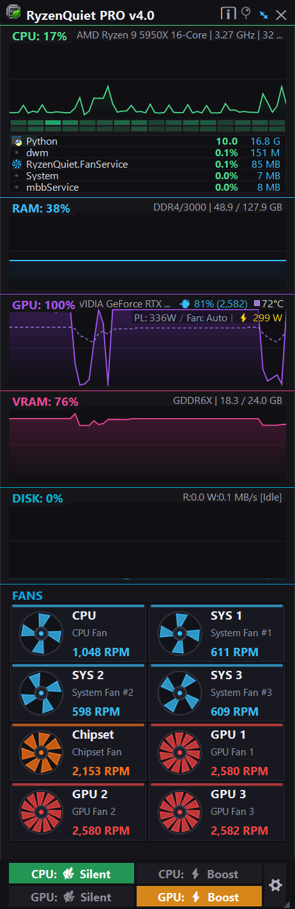
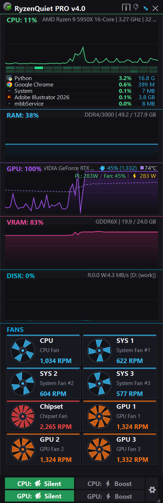
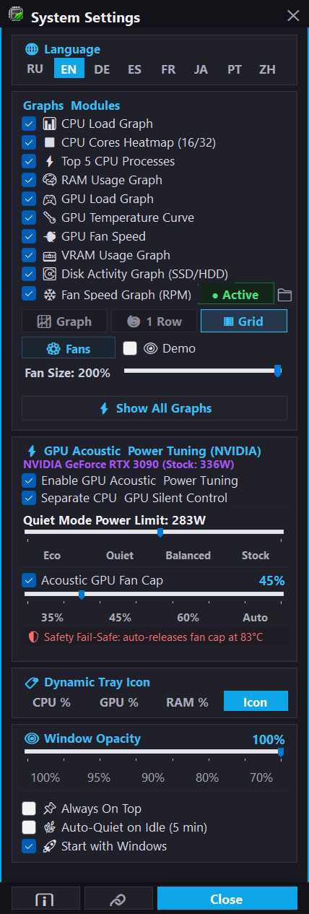
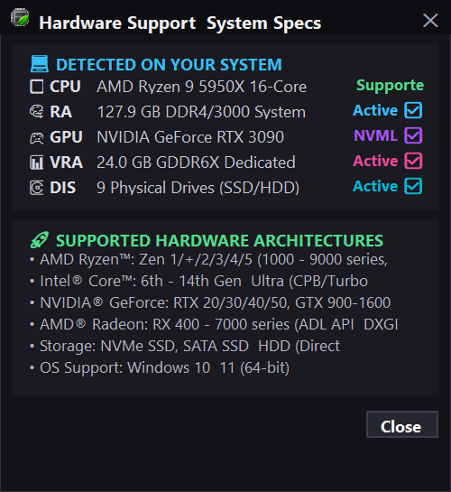

<div align="center">

# ⚡ RyzenQuiet PRO (v4.01)
**Sleek, lightweight hardware HUD & power-plan optimizer for Windows with AMD Ryzen CPB toggle, GPU power limiting & acoustic tuning, enhanced multi-disk telemetry, and modular fan monitoring.**

[-blue.svg)](#)
[](https://dotnet.microsoft.com/)
[](LICENSE)
[](https://github.com/SaidAuita/RyzenQuietPro/releases)
[](#)

<br/>

<p align="center">
  
  &nbsp;&nbsp;&nbsp;&nbsp;
  
</p>
<p align="center">
  
  &nbsp;&nbsp;&nbsp;&nbsp;
  
</p>

<br/>

[**Download Standalone (~72 MB)**](https://ph-cu-s.com/tools/ryzenquietpro) &bull; [**Download Lite (~1.4 MB)**](https://ph-cu-s.com/tools/ryzenquietpro) &bull; [**Official Website**](https://ph-cu-s.com/tools/ryzenquietpro)

<br/>

*[English](#english) &bull; [Русский](#русский)*

</div>

---

<a name="english"></a>
## 📖 Overview

**RyzenQuiet PRO** is a zero-dependency, ultra-low-overhead Windows utility combining an acoustic silencer for AMD Ryzen processors and graphics cards with a synchronized 60-second hardware telemetry HUD. It gives creators, audio engineers, developers, and gamers instant control over CPU & GPU thermals without sacrificing peak multi-core performance when needed.

Aggressive Precision Boost / CPB algorithms on modern AMD Ryzen CPUs frequently cause high voltage spikes and sudden temperature jumps during mundane background tasks, triggering loud fan ramp-ups. **RyzenQuiet PRO** fixes this with a single hotkey (`Ctrl + Alt + Q`) or one-click toggle, capping the Windows power profile to 99% to lock base clock speeds, dropping temperatures by 15–25°C and immediately silencing fans. In version 4.0, GPU acoustic and power limit tuning brings the same quiet efficiency to your graphics card.

---

## ✨ Highlights & Key Features

### 1. 🔇 AMD Ryzen CPB & Precision Boost Toggle
* **Quiet Mode (99%):** Disables Core Performance Boost (CPB), locking clocks to base frequency (~3.4 GHz), slashing voltages and thermals, and silencing fans immediately.
* **Normal / Boost Mode (100%):** Restores full multi-core boost up to 4.9+ GHz for intensive 3D rendering, video encoding, and high-FPS gaming.
* **Global Hotkey (`Ctrl + Alt + Q`):** Seamlessly toggle modes from any full-screen app or game without opening the UI.
* **Auto-Quiet on Idle:** Automatically switches to Quiet Mode when no keyboard or mouse activity is detected for > 5 minutes.

### 2. ⚡ GPU Power Limiting & Acoustic Tuning (Afterburner Alternative)
* **Real-time Watt Power Limiter:** Limit maximum GPU power consumption (W) directly in Silent Mode to reduce fan speed under load while keeping gaming or rendering stable.
* **Acoustic Fan Speed Target:** Set maximum fan RPM limit for ultra-quiet operation.
* **Separate CPU & GPU Silent Control:** Independent one-click toggle rows for CPU (Quiet 99% / Boost 100%) and GPU (Quiet / Stock Watts) with real-time HUD status indicators.
* **Thermal Fail-Safe Guard:** Automatic power restore if GPU temperature reaches 83°C to prevent thermal throttling or overheating.

### 3. 📊 Synchronized 60-Second Real-Time Performance Graphs
All subsystem graphs share a synchronized 60-second historical canvas rendered with crisp anti-aliased vector curves and gradient fills:
* 🟢 **CPU Monitor:** CPU model name, dynamic core clock frequency, thread count (e.g., `AMD Ryzen 7 6800H | 4.25 GHz | 16 threads`), thread heatmap matrix (16/32 threads), and live **Top-5 Process** resource consumers.
* 🔵 **RAM Monitor:** Instant Win32 SMBIOS memory type & speed with Used / Total physical memory (e.g., `DDR5/4800 | 18.5 / 64.0 GB`) with 0% CPU overhead.
* 🟣 **GPU Monitor:** High-precision GPU core load %, chip temperature (°C) with dashed curve, live **Power Limit & Fan RPM telemetry**, and real-time **Power Consumption in Watts** (`⚡ 136W`) via official signed NVIDIA NVML (`nvmlDeviceGetPowerUsage`). Supports AMD Radeon (ADL) and Windows GPU Engine fallbacks.
* 🌸 **VRAM Monitor:** Dedicated video memory type, load %, and live usage (e.g., `GDDR6 | 1.5 / 6.0 GB`).
* 🩵 **DISK Monitor (Smart Auto-Focus & Enhanced Multi-Disk Mode v4.01):** Unified storage activity graph with Read / Write throughput in MB/s (`R:12.4 W:45.0 MB/s`) and dynamic auto-focus on the heaviest loaded drive. When **Enhanced Multi-Disk Mode** is enabled, the graph renders each physical storage drive (NVMe SSD, SATA, HDD) with an individual vibrant color, maps all logical partitions (`C:, D: [Samsung 980 PRO 1TB]`), and provides an interactive expand/collapse legend with one-click toggles to show or hide any disk.
* ❄️ **FAN Speed Monitor (Modular Addon with 3 Visualization Modes & Hardware Spin Test):**
  * **3 Switchable Modes in Settings:**
    * **Multi-trace Graph (`📈`):** Synchronized real-time RPM history curves.
    * **1-Row Aerodynamic Icons (`🌀`):** Dynamic impeller cards with speed-tiered blade counts, smooth rotational animation, and horizontal mouse scrolling.
    * **Multi-Row Adaptive Grid (`▦`):** Compact multi-row card grid to view all active chassis, CPU, and GPU coolers simultaneously.
  * **Live Fan RPM in Subsystems:**
    * **CPU Header:** Direct live CPU fan tachometer display (e.g., `AMD Ryzen 9 5950X | 16C 32T | 🌀 1,010 RPM`).
    * **GPU Header:** Real-time GPU fan speed or silent `💤 0 RPM (0dB)` indicator when running in zero-RPM passive mode.
  * **⚡ GPU Fan Spin Test (10s):** One-click hardware diagnostic test in the fan selection dialog that spins GPU fans up to 50% PWM via LibreHardwareMonitor driver controls, validating tachometer readout and physical airflow.
  * **Custom Fan Selection Dialog (`⚙ Fans`):** Select exactly which coolers to display. Hide disconnected headers while keeping semi-passive fans visible.
  * **Full 3-Fan GPU Support:** Native mapping for 3-fan graphics cards (RTX 3090, 3080, 4090, 4080, MSI Trio, Asus TUF/Strix) where PCBs share 2 tachometer channels.
  * **Demo Mode:** Built-in fan simulation preview for systems with vendor-locked EC controllers.
  * **Isolated Plugin Architecture:** Communicates via local Named Pipes with `RyzenQuiet.FanService` to ensure 100% clean antivirus safety.
  * **💡 Motherboard & CPU Fans on Windows 11 (PawnIO Driver):**
    Windows 11 restricts legacy kernel drivers (such as WinRing0) via Core Isolation & Vulnerable Driver Blocklist. LibreHardwareMonitor 0.9.6 utilizes the modern, secure, and WHQL-compliant open-source kernel driver **[PawnIO](https://pawnio.eu/)** to access motherboard Super I/O chips (Nuvoton, ITE, Fintek).
    * To read CPU Cooler, AIO Pump, and Chassis fans, download and install PawnIO once: [**pawnio.eu**](https://pawnio.eu/) (or direct installer [**PawnIO_setup.exe**](https://github.com/namazso/PawnIO.Setup/releases/latest/download/PawnIO_setup.exe)).
    * GPU fans (NVIDIA NVAPI / AMD ADL) work out-of-the-box without requiring any kernel drivers.

### 4. ⏱️ Hardware Stopwatch & Benchmark Timer (v4.0)
* **High-Precision Telemetry Stopwatch:** Microsecond-accurate hardware timer (`hh:mm:ss.f`) anchored at the top of the HUD for timing gaming benchmarks, 3D rendering jobs, shader compiles, and encode passes.
* **Full Manual Controls:** Large high-contrast digits with instantaneous Start (`▶`), Pause/Stop (`⏸`), Reset (`↺`), and Armed Auto-Start (`⚡`).
* **Power-Triggered Auto-Start & Auto-Stop:** Automatically starts timing when system power consumption crosses a target wattage threshold [W], and automatically pauses when power drops below cutoff [W].
* **Anti-Fluctuation Hysteresis Filter:** Configurable delay (1–10 seconds) prevents premature stopping during brief momentary dips in load (such as game level loading or render pass transitions).
* **Multi-Source Criteria Switcher:** Select whether power triggers listen to `CPU`, `GPU`, `CPU + GPU` (combined load), or `Any (Max)` (whichever component spikes first).
* **Full Modular Control:** Easily hide or show the stopwatch card via the Settings dialog without affecting monitoring performance.

### 5. 📌 Detachable Floating HUD / Desktop Widget
* **Docked Mode:** Anchored next to the Windows system tray; smoothly slides out when clicking the tray icon and auto-hides when clicking away.
* **Detached Widget (`⤢`):** Undock into an independent desktop widget with free mouse dragging, **Always-On-Top** (`📌`), adjustable opacity slider (40% to 100%), and persistent position/size memory across reboots.

### 6. ⚙ Dynamic Tray Badge, Resizable Settings & Fan Management
* **Dynamic Tray Icon:** Live percentage badge rendered directly onto the system tray icon (choose between CPU %, GPU %, or RAM %).
* **Smart Tooltip:** Multi-line status tooltip showing current power mode and all subsystem stats at a glance.
* **Resizable Settings Dialog:** Smooth interactive edge/corner resizing and bottom-right `◢` grip handle, widened to 500px to eliminate horizontal scrollbars, auto-saving your preferred dialog width to `settings.json`.
* **Fan Service Status & Controls:** Restored `• Active` green badge with hover-to-stop interaction, clean service toggling, and isolated test/demo mode.
* **Single Centered Vector Gear:** Clean 6-tooth vector settings cog centered right between CPU and GPU controls.
* **Zero Telemetry & Portable:** Pure Win32 / NVML / PDH APIs, no third-party kernel drivers, no background network calls. Preferences stored in `%LOCALAPPDATA%\RyzenQuietPro\settings.json`.

---

## ⌨️ Controls & Shortcuts

| Shortcut / Button | Action |
|---|---|
| <kbd>Ctrl</kbd> + <kbd>Alt</kbd> + <kbd>Q</kbd> | Toggle **Quiet Mode (99%)** / **Boost Mode (100%)** |
| `⏱` **Stopwatch** | Start (`▶`), pause (`⏸`), reset (`↺`), or arm auto-start (`⚡`) by CPU/GPU power load |
| `⤢` / `⤡` | Detach into floating desktop widget / Dock to tray flyout |
| `📌` | Toggle **Always-On-Top** over full-screen games & windows |
| `⚙` | Open visibility menu to show/hide individual modules & graphs |
| `ℹ` | Inspect hardware specs, multi-GPU detection, and compatibility |
| **Opacity Slider** | Adjust widget transparency from 40% to 100% |

---

## 📦 Downloads & Editions

| Edition | Size | Description |
|---|---|---|
| **Standalone** *(Recommended)* | ~70 MB | Single executable with embedded .NET 8 runtime. Runs out-of-the-box on any Windows 10/11 x64 PC with zero dependencies. |
| **Lite Edition** | ~1.2 MB | Ultra-compact single binary. Requires Microsoft .NET 8 Desktop Runtime installed. |
| **Fan Service Addon** | ~5 MB | Optional background service (`plugins\FanService\RyzenQuiet.FanService.exe`) for motherboard & CPU fan RPM monitoring with zero AV false positives. |

> Downloads are available directly on [**ph-cu-s.com/tools/ryzenquietpro**](https://ph-cu-s.com/tools/ryzenquietpro) or on the [**GitHub Releases**](https://github.com/SaidAuita/RyzenQuietPro/releases) page.

---

## 🛠️ How to Build

### Prerequisites
* Windows 10 or 11 (64-bit)
* [.NET 8 SDK](https://dotnet.microsoft.com/download/dotnet/8.0)

### Build Commands
Run `build.bat` from the project root:
```cmd
build.bat
```

Or build manually via .NET CLI:
```cmd
# Standalone Edition (~70 MB)
dotnet publish -c Release -r win-x64 --self-contained true -p:PublishSingleFile=true -p:EnableCompressionInSingleFile=true -o build\

# Lite Edition (~1.2 MB)
dotnet publish -c Release -r win-x64 --self-contained false -p:PublishSingleFile=true -o build\
```

---

## 🛠️ Other Projects

**[Free Automation Tools & Utilities](https://ph-cu-s.com/tools)**
* Free open-source scripts, extensions, and desktop utilities for Adobe Illustrator, InDesign, Photoshop, and Windows performance optimization.

**[ComfyUI Photoshop Plugin (PH-CU-S)](https://github.com/SaidAuita/ComfyUI_PH-CU-S)**
* A powerful Photoshop plugin powered by ComfyUI, providing direct integration with local generative models.

**[AI Dimension](https://github.com/SaidAuita/AI-Dimension)**
* Automatic technical dimensioning, bounds, leader lines, and drafting scales extension for Adobe Illustrator.

**[ID Dimension](https://github.com/SaidAuita/ID-Dimension)**
* Automatic technical dimensioning, bounds, leader lines, and drafting scales for Adobe InDesign.

---
---

<a name="русский"></a>
<div align="center">

# ⚡ RyzenQuiet PRO (v4.01) — Описание на русском
**Стильный, легковесный аппаратный HUD-монитор и менеджер профилей питания для Windows с мгновенным отключением CPB у процессоров AMD Ryzen, акустическим контролем и ограничением мощности видеокарт (GPU Power Limiting), расширенным мониторингом накопителей и модульным мониторингом вентиляторов.**

</div>

## 📖 Описание проекта

**RyzenQuiet PRO** решает одну из самых наболевших проблем современных процессоров AMD Ryzen и мощных видеокарт — внезапные резкие скачки температур и назойливый вой вентиляторов кулера при банальном серфинге в браузере, офисной работе, написании кода, играх или работе со звуком. 

Утилита объединяет в себе акустический глушитель процессора и видеокарты с высокоточным оверлеем аппаратного мониторинга на синхронизированной 60-секундной истории всех графиков. По нажатию одной кнопки или глобального хоткея (`Ctrl + Alt + Q`) утилита переключает профиль питания процессора на 99%, что аппаратно блокирует алгоритм Precision Boost / CPB на базовой частоте (~3.4 ГГц), сбрасывает напряжение на ядрах, снижает температуру на 15–25°C и делает компьютер абсолютно бесшумным. В версии 4.0 встроен модуль тюнинга мощности и акустики GPU (альтернатива MSI Afterburner), позволяющий программно ограничить лимит мощности и шум кулеров под нагрузкой.

---

## ✨ Ключевые возможности

### 1. 🔇 Переключение AMD Ryzen CPB & Precision Boost
* **Тихий режим (Quiet 99%):** Отключает Core Performance Boost (CPB), фиксируя тактовую частоту на базовом уровне (~3.4 ГГц), снижает нагрев и напряжение, мгновенно останавливая шум вентиляторов.
* **Режим Boost (100%):** Моментально возвращает полный многопоточный буст до 4.9+ ГГц для рендеринга, компиляции и игр.
* **Глобальный хоткей (`Ctrl + Alt + Q`):** Переключение режима из любого приложения или игры без сворачивания окон.
* **Авто-тишина при простое (Auto-Quiet):** Автоматический переход в тихий режим при отсутствии активности пользователя более 5 минут.

### 2. ⚡ Ограничение мощности и акустический тюнинг GPU (Аналог Afterburner)
* **Программный лимит мощности (Ватты):** Удобная настройка максимального энергопотребления видеокарты в тихом режиме для предотвращения раскрутки вентиляторов до максимальных оборотов.
* **Раздельное управление CPU и GPU:** Отдельные независимые кнопки переключения тихих и производительных режимов для процессора и видеокарты прямо в интерфейсе.
* **Аварийная защита от перегрева (Fail-Safe 83°C):** Автоматический сброс лимита при достижении критической температуры для гарантии безопасности оборудования.

### 3. 📊 Синхронизированные 60-секундные графики нагрузки
Все графики системы работают на единой 60-секундной временной шкале с векторными сглаженными кривыми и градиентной заливкой:
* 🟢 **Монитор CPU:** Модель процессора на первом месте, динамическая частота ядер и число потоков (например, `AMD Ryzen 7 6800H | 4.25 GHz | 16 потоков`), наглядная тепловая карта загрузки всех ядер (16/32 потока) и список **Top-5 процессов**.
* 🔵 **Монитор RAM:** Опрос типа и частоты памяти через Win32 SMBIOS Type 17 с отображением занятой и общей памяти (например, `DDR5/4800 | 18.5 / 64.0 GB`) с 0% нагрузки на CPU.
* 🟣 **Монитор GPU:** Нагрузка графического чипа в %, температура ядра (°C) с пунктирной линией, статус **Power Limit & Fan RPM** и **реальное энергопотребление в ваттах** (`⚡ 136W`) через официальный подписанный NVIDIA NVML (`nvmlDeviceGetPowerUsage`). Поддержка AMD Radeon (ADL) и Windows GPU Engine.
* 🌸 **Монитор VRAM:** Тип видеопамяти, процент нагрузки и точный объём занятой VRAM (например, `GDDR6 | 1.5 / 6.0 GB`).
* 🩵 **Монитор накопителей (DISK) с умным фокусом и расширенным режимом (v4.01):** Общая дисковая активность и скорость чтения/записи в МБ/с (`R:12.4 W:45.0 MB/s`) с авто-фокусом на самом нагруженном диске. При включении **расширенного режима** в настройках график выводит отдельную цветную линию для каждого физического диска (NVMe SSD, SATA, HDD), маппит все логические разделы (`C:, D: [Samsung 980 PRO 1TB]`) и предоставляет интерактивную легенду в основном окне с возможностью включения/отключения любого накопителя в один клик.
* ❄️ **Монитор кулеров (Изолированное дополнение с 3 режимами и тестом кулеров):**
  * **3 переключаемых режима в настройках:**
    * **График (`📈`):** Синхронизированные кривые RPM в реальном времени.
    * **В 1 ряд (`🌀`):** Векторные карточки вентиляторов с динамическим числом лопастей, плавной анимацией вращения и горизонтальной прокруткой.
    * **Сетка (`▦`):** Компактная адаптивная сетка карточек, позволяющая видеть сразу все кулеры без прокрутки.
  * **Живые обороты в шапках процессора и видеокарты:**
    * **CPU:** Прямой вывод оборотов кулера процессора (например, `AMD Ryzen 9 5950X | 16C 32T | 🌀 1,010 RPM`).
    * **GPU:** Отображение реальных RPM или статуса тишины `💤 0 RPM (0dB)`, когда кулеры видеокарты находятся в полупассивном режиме.
  * **⚡ Тест раскрутки кулеров GPU (10с):** Кнопка 10-секундного теста в окне выбора кулеров для безопасной раскрутки вентиляторов видеокарты на 50% мощности через ШИМ.
  * **Окно выбора отображаемых кулеров (`⚙ Выбор`):** Индивидуальная настройка видимости каждого кулера в системе.
  * **Поддержка 3-кулерных видеокарт:** Автоматическое сопоставление 3 физических вертушек на платах с 2 аппаратными тахометрами (RTX 3090, 3080, 4090, 4080 и др.).
  * **Демо-режим:** Возможность включить визуализацию и оценить интерфейс даже на ноутбуках с заблокированным EC-контроллером.
  * **Изолированная архитектура:** Работает через локальный именованный канал (Named Pipe) с отдельным процессом `RyzenQuiet.FanService`.
  * **💡 Мониторинг кулеров процессора и платы в Windows 11 (Драйвер PawnIO):**
    В Windows 11 устаревшие драйверы ядра (например, WinRing0) блокируются политиками безопасности ядра (Core Isolation / Список уязвимых драйверов). LibreHardwareMonitor 0.9.6 использует современный, безопасный и подписанный драйвер **[PawnIO](https://pawnio.eu/)** для прямого доступа к контроллерам Super I/O материнских плат (Nuvoton, ITE, Fintek).
    * Для отображения кулера CPU, помпы СЖО и разъемов корпуса установите PawnIO с официального сайта: [**pawnio.eu**](https://pawnio.eu/) (прямой установщик: [**PawnIO_setup.exe**](https://github.com/namazso/PawnIO.Setup/releases/latest/download/PawnIO_setup.exe)).
    * Обороты кулеров видеокарты (NVIDIA NVAPI / AMD ADL) считываются сразу из коробки без установки драйверов ядра.

### 4. ⏱️ Аппаратный секундомер и таймер бенчмарков (v4.0)
* **Высокоточный таймер телеметрии:** Аппаратный таймер с миллисекундной точностью (`чч:мм:сс.д`), расположенный в верхней части оверлея над графиком процессора для замера времени рендеринга, компиляции шейдеров, экспорта видео или игровых сессий.
* **Полное ручное управление:** Крупные контрастные цифры в стиле HUD с кнопками мгновенного запуска (`▶`), паузы/остановки (`⏸`), сброса (`↺`) и взвода автостарта (`⚡`).
* **Автостарт и автостоп по мощности (Ватты):** Автоматический старт отсчета при превышении заданной мощности [W] и остановка при снижении нагрузки ниже порога [W].
* **Защита от ложных остановок (Гистерезис):** Настраиваемая задержка (1–10 секунд) предотвращает преждевременную остановку таймера при кратковременных просадках нагрузки (например, во время смены сцен в бенчмарках или экранов загрузки в играх).
* **Гибкий выбор критерия нагрузки:** Переключатель источника мощности автостарта — `CPU`, `GPU`, `CPU + GPU` (суммарная мощность системы) или `Любой (Max)` (по первому превысившему порог компоненту).
* **Модульное отключение:** Возможность скрыть или показать панель секундомера в любой момент в окне настроек.

### 5. 📌 Плавающий виджет на рабочий стол / HUD
* **Режим трея (Docked):** Аккуратная всплывающая панель около системного трея, открывающаяся по клику на значок и скрывающаяся при клике в любое другое место.
* **Плавающий виджет (`⤢`):** Открепление в независимое окно с плавным перетаскиванием мышью, режимом **Поверх всех окон** (`📌`), ползунком прозрачности (от 40% до 100%) и сохранением координат и размеров на экране.

### 6. ⚙ Динамический бейдж в трее, масштабируемые настройки и управление службой
* **Живой значок в трее:** Отображение процента загрузки (CPU %, GPU % или RAM %) прямо на иконке в трее (32×32 px).
* **Информативная подсказка:** Многострочный тултип при наведении со всеми показателями системы.
* **Масштабируемое окно настроек:** Свободное изменение размеров окна мышью за края, углы или за маркер `◢` в правом нижнем углу, увеличенная ширина (500px) без горизонтальных полос прокрутки и сохранение выбранных размеров в `settings.json`.
* **Индикация и управление службой кулеров:** Понятный статус `• Active` с зеленой подсветкой и возможностью мягкой остановки при наведении, разделение реального мониторинга и симуляции/демо-режима.
* **Векторная шестеренка:** Центрированная кнопка настроек в правом блоке режимов.
* **100% оффлайн и чистый код:** Никаких сторонних драйверов уровня ядра, никакой фоновой аналитики и телеметрии, настройки сохраняются локально в `%LOCALAPPDATA%\RyzenQuietPro\settings.json`.

---

## ⌨️ Управление и горячие клавиши

| Сочетание / Кнопка | Действие |
|---|---|
| <kbd>Ctrl</kbd> + <kbd>Alt</kbd> + <kbd>Q</kbd> | Переключение между **Тихим режимом (99%)** и **Boost (100%)** |
| `⏱` **Секундомер** | Старт (`▶`), пауза (`⏸`), сброс (`↺`) или взвод автостарта (`⚡`) по мощности CPU/GPU |
| `⤢` / `⤡` | Открепить в плавающий виджет на рабочий стол / Прикрепить к трею |
| `📌` | Закрепить оверлей поверх всех окон (Always-On-Top) |
| `⚙` | Меню видимости графиков, тюнинга GPU и списка процессов |
| `ℹ` | Диалоговое окно информации об оборудовании |
| **Ползунок прозрачности** | Регулировка прозрачности виджета от 40% до 100% |

---

## 📦 Варианты загрузки

| Редакция | Размер | Описание |
|---|---|---|
| **Standalone** *(Рекомендуется)* | ~72 МБ | Единый исполняемый файл со встроенной сжатой средой .NET 8. Работает из коробки на любой Windows 10/11 x64 без установки дополнительного ПО. |
| **Lite Edition** | ~1.4 МБ | Ультралегкий компактный файл. Требует установленного в системе Microsoft .NET 8 Desktop Runtime. |

> Скачать сборки можно на странице [**ph-cu-s.com/tools/ryzenquietpro**](https://ph-cu-s.com/tools/ryzenquietpro) или в разделе [**GitHub Releases**](https://github.com/SaidAuita/RyzenQuietPro/releases).

---

## 🛠️ Сборка из исходников

### Требования
* Windows 10 или 11 (64-bit)
* [.NET 8 SDK](https://dotnet.microsoft.com/download/dotnet/8.0)

### Запуск сборки
Просто запустите скрипт `build.bat` в корне проекта:
```cmd
build.bat
```

Исполняемые файлы будут скомпилированы в каталог `build\`:
* `build\RyzenQuietPro-v4.0.exe` (Standalone)
* `build\RyzenQuietPro-v4.0-Lite.exe` (Lite)
* `build\plugins\FanService\RyzenQuiet.FanService.exe` (Fan Monitor Addon)

---

## 🛠️ Мои проекты

**[Каталог бесплатных утилит и инструментов (PH-CU-S Tools)](https://ph-cu-s.com/tools)**
* Сборник бесплатных скриптов, расширений и системных утилит для Adobe Illustrator, InDesign, Photoshop и оптимизации Windows.

**[ComfyUI Photoshop Plugin (PH-CU-S)](https://github.com/SaidAuita/ComfyUI_PH-CU-S)**
* Мощный плагин для Photoshop на базе ComfyUI, обеспечивающий прямую интеграцию с локальными генеративными моделями.

**[AI Dimension](https://github.com/SaidAuita/AI-Dimension)**
* Аналогичное расширение для автоматической расстановки размеров в Adobe Illustrator.

**[ID Dimension](https://github.com/SaidAuita/ID-Dimension)**
* Расширение и автономный скрипт для автоматической расстановки размеров в Adobe InDesign.

---

## 📄 License
Распространяется под свободной лицензией **MIT**. Подробности в файле [LICENSE](LICENSE).
